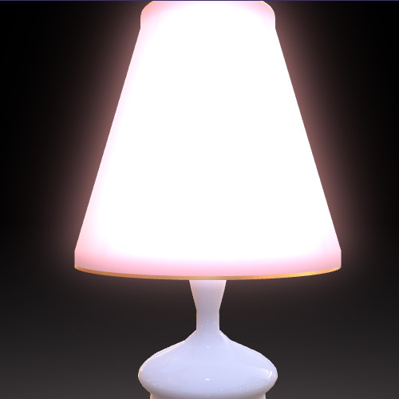
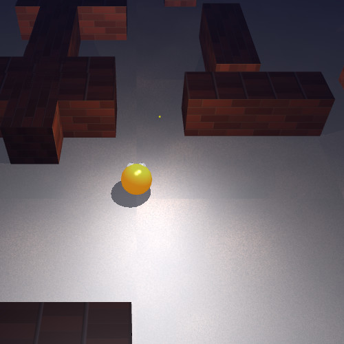
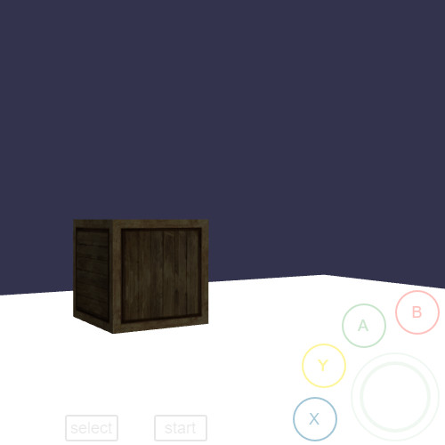
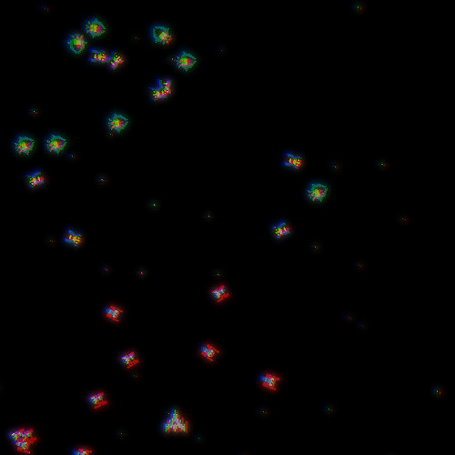
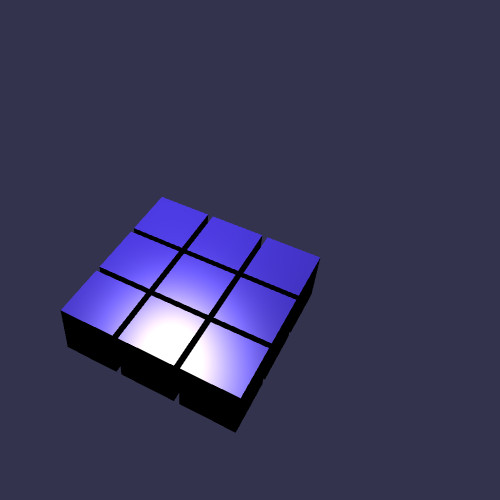
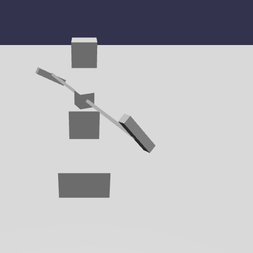

# Babylon.js Exercises

## 示例

## 资源

- https://forum.babylonjs.com/t/examples-from-the-playground/3175
- https://github.com/Symbitic/awesome-babylonjs#demos
- [Babylon.js Node Material Editor](https://nme.babylonjs.com/#XDUFVU#8
- [Search playgrounds](https://doc.babylonjs.com/playground)
- https://fastly.jsdelivr.net/gh/NasimiAsl/Extensions@master/ShaderBuilder/Babylonx.ShaderBuilder.js
- https://fastly.jsdelivr.net/gh/NasimiAsl/Extensions@master/GeometryBuilder/SGBD.js
- https://forum.babylonjs.com/t/examples-from-the-playground/3175/1220

